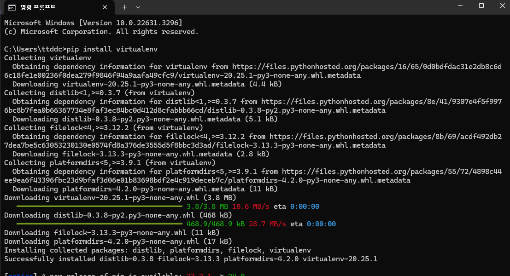
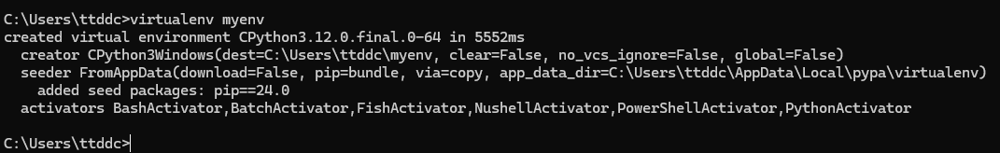
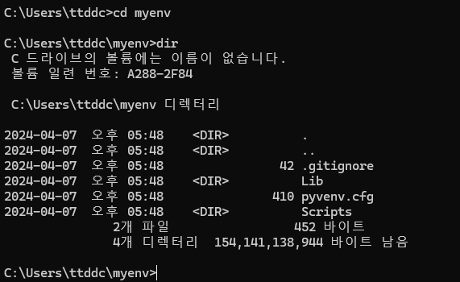
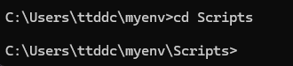
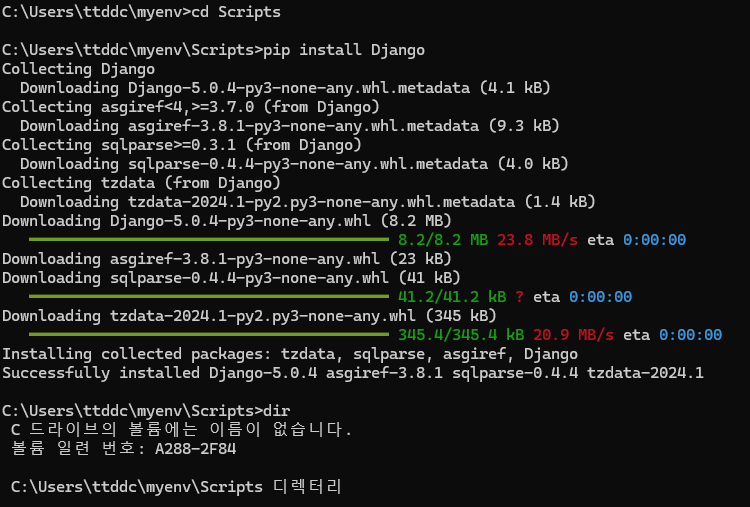
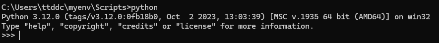
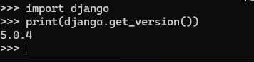

# 가상환경 설정

출처 : https://www.youtube.com/watch?v=alrLd9T96aA

가상환경 설정은 `window -> cmd` 로 명령 프롬프트를 이용해 설치함

## 가상환경 라이브러리 설치

파이썬 설치 후 `pip install ..` 이란 문구를 이용해 라이브러리를 설치하는게 가능

> 라이브러리 ? -> 누가 이미 코드로 어떤 활동을 가능하게 하는 코드 모음집이라 생각하면 됨
> `pip install virtualenv` 는 `virtualenv` 라는 라이브러리를 설치하는거고 해당 라이브러리는 가상환경을 만들 수 있게 해주는 라이브러리임

## 가상환경 생성하기

`virtualenv myenv` 를 통해 `virtualenv` 라이브러리를 이용해 `myenv` 라는 이름을 가진 가상환경을 생성하려고 하는거임

이름은 내마음대로 해도 됨

## 가상환경 활성화 하기

윈도우에서의 가상환경 생성법

`cd myenv` 로 내 가상환경 폴더에 접근

> `cd` 는 이동하는 거임 , 클릭하는거라 생각하셈 `myenv` 폴더를 클릭해서 들어간다고 생각해도 ㄱㅊ

`cd myenv` 로 이동하면 나는 지금 `myenv` 폴더에 들어가있는거임

여기서 `dir` 로 하면 해당 폴더에 존재하는 파일이나 폴더명을 볼 수 있음

`myenv` 에 `Scripts` 폴더가 있음

`Scripts` 폴더로 또 이동하자

그럼 `Scripts` 폴더로 이동했음 지금

`Scripts` 폴더에서 `pip install django` 를 통해 `django` 라이브러리를 설치함

> ### 왜 `Scripts` 를 만들고 그 안에서 `django` 를 설치하냐 ?
>
> 가상환경을 생성하는 이유는 하나의 컴퓨터에서 여러개의 라이브러리를 설치하면
> 라이브러리끼리 충돌 할 수 있음
> 가장 베스트는 ? 컴퓨터 하나당 프로젝트에 필요한 라이브러리만 설치하는거임
> 근데 컴퓨터 프로젝트 할 떄 마다 사는거 ? 스튜핏
> 그래서 가상의 컴퓨터역할처럼 가상 환경을 생성하고 그 환경에서 라이브러리를 설치하는거임
> 내 컴퓨터 내에서 가상의 컴퓨터를 설치한다 생각해도 ㄱㅊ음
> 그럼 이제 `/myenv/Scripts` 폴더 내에서만 `django` 라이브러리를 설치했기 때문에 저 안에서만 `django` 를 사용하는게 가능함

## 가상환경에서 파이썬 실행하기

`Scripts` 폴더 내에서 `python` 을 쳐서 파이썬을 킴

> 터미널 환경에서 `python` 이라 입력하는건 , 그 폴더 내에서 파이썬 프로그램을 클릭하는거랑 똑같다고 생각하면 됨

## `django` 잘 설치됐나 확인하기

파이썬 켜놨으니까 파이썬에서 코드 입력하는 것처럼 장고를 `import` 하고 `django.get_version()` 으로 깔린 장고의 버전을 확인함

잘 깔렸음 굿
