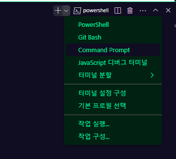

# 프로젝트 시작하기

### 가상환경 키기


`Scripts` 폴더까지 `cd` 를 이용해 이동한 담에

`activate.bat` 을 활성화 시켜 가상 환경을 구동시켜줌

> `activate.bat` 을 입력하는건 마우스로 `activate.bat` 프로그램을 실행시킨거라고 생각해도 됨
> 저 프로그램은 가상환경을 키는 프로그램이라 생각해

그래서 나는 지금 가상환경을 켜뒀음

> 가상환경을 켜두다 ?
> 가상환경이란 가상의 컴퓨터라 생각하라 했지
> 나는 지금 내 컴퓨터가 아니라 가상의 컴퓨터로 작업하는거라고 생각하자

### 프로젝트 만들기

이제 프로젝트를 만들 폴더를 만들고

해당 폴더 내부에서 프로젝트를 만들자

나는 `C:\Users\ttddc\OneDrive\바탕 화면\github\djangostudy` 라는 경로에서 할거니까 해당 경로로 이동하자


`django-admin startproject mysite` 를 입력해서 해당 폴더에서 `django` 프로젝트를 생성하자


내 폴더 보면 잘 설치됐음

### `VScode` 에서 해당 파일 열기


폴더 열기로 해서 누르면 `vscode` 에서 해당 폴더와 연동되는 `vscode` 를 만들 수 있음

`vscode` 는 해당 폴더 내에서 현재 작업이 가능하게 됐음


# 파일 별 정의

그 중 가장 유의미한 거

- `mysite/settings.py` : 현재 `Django` 프로제긑의 환경 및 구성을 저장한다.
- `mysite/urls.py` : 프로젝트를 서비스하기 위한 웹 서버의 진입점

# 클라이언트가 어떻게 서버에 접속하는가 ?


기본적으로 웹 서버는 `HTTP` 통신을 이용하는데 중점적으로 볼 것은 그냥

클라이언트 (사용자) 가 서버 측 주소에 접속하면

서버는 클라이언트가 접속한 주소에 맞는 페이지를 보내주면 됨

이 때 클라이언트가 주소에 접속하는 행위를

주소 (`URI`) 를 이용해 서버 측에 `reqeust` 를 보낸 것이라 하며

서버는 클라이언트가 접속한 주소에 따라 적합한 데이터 (페이지) 를 `response` 함

# `VSCODE` 에서 `DJANGO` 실행시키는 방법

### `VSCODE` 에서 가상환경 실행하는 방법

`VSCODE` 에서 `ctrl` + `(~표시) 를 누르면`VSCODE` 의 터미널을 열 수가 있음

얘는 `CMD` 와 같은 명령프롬프트와 동일함


여기서 우층 상단에 존재하는 `+` 버튼 옆에 있는 버튼을 눌러 사용할 프롬프트를

`CMD` 로 변경해주자



이제 가상환경을 구동시켜주자


`cd ..` 는 터미널에서 뒤로가기 버튼이라 생각하면 됨

이렇게 가상환경이 켜졌음 `(myenv)` 가 켜진걸 볼 수 있음

### `VSCODE` 에서 서버를 구동시키는 방법


서버를 구동시키기 위해선 `mysite` 에 존재하는 `manage.py` 를 구동시켜야함


`cd` 를 이용해서 `mysite` 가 있는 폴더까지 이동하고

`py manage.py runserver` 를 이용해 `manage.py` 프로그램을 실행하자

> `py` 붙는건 파이썬 프로그램을 실행시키기 위한 터미널 명령어라 생각해도 괜찮음


뭐라 오류가 뜨긴 하는데 `http://127.0.0.1:8000` 주소에 서버가 열렸다고 뜸

컨트롤 + 클릭으로 해당 링크를 클릭하든지 주소창에 입력해서 들어가보자


아 굿 ~~

> ### `http://127.0.0.1:8000` 주소가 의미하는 것
>
> 웹 서버들은 항상 본인만의 주소를 갖고 있음, 예를 들어 네이버의 주소가 `http://www.naver.com` 인 것 처럼
>
> > 사실은 `http://www.naver.com:80` 임
> > 근데 사실은 또 `http://네이버 서버의 IP주소 : 80` 임
> > 근데 서버의 `IP` 주소로 찾는거 ? 힘들어
> > 그래서 `DNS` 라고 도메인 네임 서버라고 해서 `www.naver.com` 에 접속하면 네이버 서버의 `IP` 주소에 접속하게 됨
> > `:80` 은 포트번호란건데 이건 나중에 알아도됨 몰라도 돼 사실
> > `http://127.0.0.1:8000` 이란 나의 서버 주소는 **내 컴퓨터를 서버로서 작동시키겠단 거임**
> > 내 컴퓨터가 마치 네이버의 서버 역할을 하는거랑 똑같다 생각해도 됨
> > 다만 이건 내 컴퓨터에서만 접속이 가능한 서버임, 다른 사람들은 해당 서버에 접속 못함 개발 목적에서만 사용함 , 근데 아마 과제에서는 해당 서버를 이용하게 될거임

### `VSCODE` 에서 서버를 중지하는 방법

컨트롤 + C 누르면 서버 구동이 중지됨

### `VSCODE` 에서 프로젝트를 만드는 방법


다음과 같은 명령어로 `startapp polls` 를 만들음 이건 나중에 배우자


그러면 `polls` 폴더가 만들어짐

### `polls/urls.py` 파일 생성하기


해당 폴더에서 `urls.py` 파일을 만들어주자

> 어떻게 만드는데 ?
> 
> 해당 폴더를 클릭하고 새 파일을 만들어

### `polls/view.py` 에 사용자에게 보여질 페이지 생성하기

```python
from django.http import HttpResponse

def index(request):
  return HttpResponse("안녕 반가워 너는 지금 polls index에 있어")
```

`from django.http import HTTPResponse` 는 `django.http` 라이브러리에서 `HTTPResponse` 라는 함수를 사용하겠다는 거임

불러옴으로서 나는 이제 `HTTPResponse` 함수를 사용 할 수 있음

`def index(request) : ... ` 는 `index` 라는 함수를 만들겠단 거고 `index` 함수를 호출하면 `:` 내부에 있는 코드가 실행됨

`return HTTPResponse .. ` 는 `HTTPResponse("안녕 반가워 너는 지금 polls index에 있어")` 라는 값을 반환하겠다는 거임

##### 값을 반환한다 ?

```py

def sum(a,b):
  # a = 1 , b = 2 라는 값으로 밑의 코드를 실행함
  return a + b # 3이란 값을 반환함

c = sum(1,2) # 반환된 3이란 값이 c 에 할당됨
print(c) # 3
```

`polls/urls.py` 파일을 열어 살펴보자

```python
from django.urls import path

from . import views

urlpatterns = [
    path("", views.index, name="index"),
]
```

`from . import views` 라는 것은 `views.py` 파일을 불러오겠다는 거임

>

```python
from django.http import HttpResponse
def index(request):
  return HttpResponse("안녕 반가워 너는 지금 polls index에 있어")
```

> 지금 `view` 파일에는 `index` 라는 이름의 함수가 존재한단 사실을 기억하자

`path("" , views.index , name = 'index')` 라는 것은 뭘 의미할까 ?

`path ('')` 는 내가 접속하고자 하는 주소를 의미함

지금 내 서버 주소가 `http:127, ... : 8000` 이라고 했지 ?

`http:127 ... : 8000` 으로 접속하면 `views.index` 파일을 전송하겠다는 것을 의미함

예를 들어서 유튜브로 생각해보자


유튜브의 지금 주소는 `youtube.com` 임 `youtube.com` 에 접속하면 이렇게 메인 페이지를 반환하는거임

유튜브에서 내 페이지 버튼을 눌러보자


`youtube.com/channel/ ... ` 처럼 `/` 로 이뤄진 어떤 주소를 보여주지 ?

이게 바로 `/channel/ ... 어쩌구` 에 접속하면 저 페이지를 서버가 우리에게 보내주는거임

그럼 다시 본론으로 돌아와서

`path("" , views.index , name = 'index')` 이건 뭘 의미하냐 ?

`http://127 .. :8000/` 에서 `/` 이후에 아무것도 없지 ? 그럼 아무것도 없는 메인 페이지에선

`views` 파일에 있는 `index` 함수를 실행시킨 후 반환되는 값을 띄우라는거임 서버에서

> 본격적인 내용은 `docs 3` 에서 진행하도록 하자
