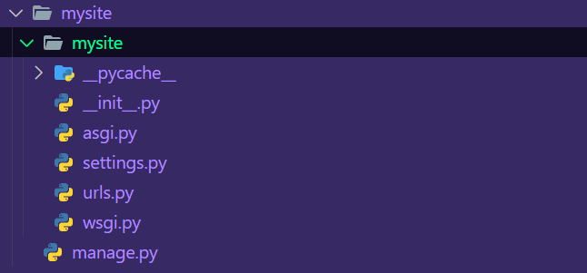
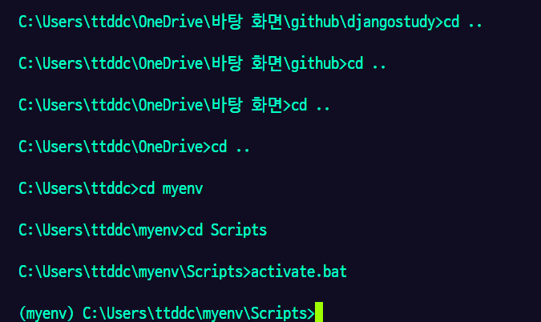
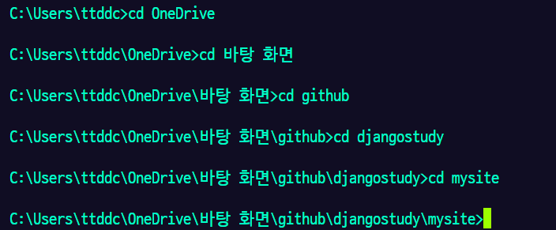
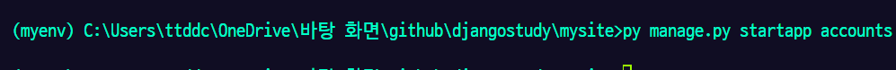
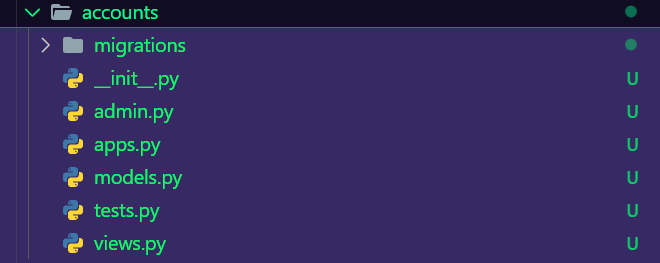
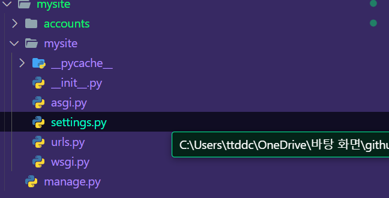

# `Recap`

우리는 지난 `docs` 에서 가상환경을 생성했고

VSCODE 터미널로 가상환경을 실행하는 방법을 배웠다.

그리고 프로젝트를 만드는 것 까지 성공했다.

이를 통해 우리는 `mysite` 라는 폴더를 생성했고



내부에 다음과 같은 여러 파일들을 생성했다.

기본적으로 프로젝트 생성 시 생성되는 파일들은 `django` 라이브러리 자체에서 본인들이 관리하는 코어 라이브러리라고 생각하자

우리가 원하는 기능을 만들기 위해선 이제 이 프로젝트를 커스터마이징해야 한다.

커스터마이징 하기 위한 폴더를 생성해보자

> ### 용어를 명확하게 정의하자
>
> 프로젝트를 만들면서 생성된 파일들을 `프로젝트` 라고 한다.
> 프로젝트만으로는 우리가 서비스를 제공 할 수 없다.
> 우리가 원하는 서비스가 담긴 폴더 , 혹은 그 이하의 논리적 구조를 앱 이라고 한다.

# 앱 만들기

### 가상환경 구동하기

> **가상환경을 구동하기 위해선 `VSCODE`의 터미널을 `cmd` 로 변경해줘야 한다.** > `VSCODE` 의 터미널은 여러 종류의 프롬프트를 지원한다.
> 이전 `docs` 에서 `VSCODE` 의 터미널을 `cmd` 터미널로 이동하는 방법을 소개했었다.



우선 앱을 만들기 전 가상환경을 꼭 켜두자

가상환경을 킨다는 것은 쉽게 말해

내 프로젝트를 위한 컴퓨터를 내가 사용하는 거라 생각하자

프로젝트들이 담긴 컴퓨터 앞에 내가 앉는 행위 자체가 , 가상환경을 키는거다.

가상환경을 킴으로서 우리는 프로젝트를 위한 컴퓨터의 전원을 켰다.

### 파일 폴더로 이동하기

가상환경을 키고 나면 현재 나의 경로는 가상환경 폴더에 존재한다.

위 경로를 보자 우리는 지금 `/myenv/Scripts` 폴더에 있다.

이제 우리가 생성한 폴더로 이동해주자



> 이동하기 위한 폴더명은 사용자에 따라 다를 수 있다. 잘 해보자

### `app` 만들기



`py maange.py startapp accounts` 를 이용하여 앱을 만들기 위한 폴더인 `accounts` 폴더를 생성해주자



`accounts` 폴더에는 우리가 원하는 기능을 구현하기 위한 로직들을 구현해주면 된다. :)

정말 고맙게도 `django` 에선 기본적인 앱들을 위해 필요한 파일들을 생성할 수 있는 명령어를 제공한다.

우리는 방금 회원가입 앱을 만들기 위해 필요한 파일들을 모두 생성해주었다.

### 코드를 치기 전 , 로직을 먼저 생각해보기

`django` 에서는 어떻게 웹 페이지를 만들까 ?

회원가입 서비스 예제를 통해 생각해보자

1. 사용자가 회원가입을 위한 주소로 접근한다. 예를 들어 접근 주소를 `/createuser` 라고 해보자

   > 웹에선 주소를 `/` 부터 시작한다.
   > 우리가 네이버 서버의 서버 관리자라고 생각해보자
   > 우리는 사용자들에게 `www.naver.com` 이란 주소를 기본적으로 제공하고 사용자가 네이버 카페에 접근 할 때 `www.naver.com/cafe` 로 접근한다.
   > 모든 접근에는 우리의 기본 서버 주소인 `www.naver.com` 이후 `/ ...` 이후의 주소로 접근 하기 때문에 서버 관리자 입장에선 `www.naver.com/cafe` 라고 치는 것보다 그냥 `/cafe` 만 입력하도록 한다.

2. 사용자가 `/craeteuser` 경로에 접근하게 되면 서버 측에 요청을 보내게 된다. (`reqeust`)

   > 사용자 : 야 서버 , 나 `/cafeuser` 에 접근했어 , 이 경로에는 어떤 정보가 있니 ?

3. 서버는 사용자가 접근한 주소를 기준으로 해당 주소에 맞는 정보를 제공해야 한다.

   > 서버 : 사용자의 요청이 `/craeteuser` 네 ? 해당 주소에는 회원가입 페이지를 전송해줘야지

4. 서버는 사용자에게 `/createuser` 에 해당하는 페이지 (`HTML` 문서) 를 제공한다.
   > `HTML` 문서는 웹페이지를 개발하는 언어라고 생각하자. :)

우리는 앞으로 이러한 로직을 코드로 구현 할 것이다.

# 전체적인 로직을 먼저 경험해보고 회원가입 페이지를 만들어보자

### 프로젝트와 앱을 연동시켜주자



`mysite` 폴더에 존재하는 `settings.py` 파일을 열자

이거는 `django` 프로젝트의 설정과 관련된 설정을 모아둔 셋팅 파일이다.

```python
INSTALLED_APPS = [
    'django.contrib.admin',
    'django.contrib.auth',
    'django.contrib.contenttypes',
    'django.contrib.sessions',
    'django.contrib.messages',
    'django.contrib.staticfiles',
    # 추가
    'accounts' # 앱 폴더 (accounts) 와 프로젝트를 연동
]
```

해당 파일을 잘 찾다보면 `INSTALLED_APPS` 의 리스트에 우리가 만든 폴더명을 추가해주자

> `[]` 내부에 여러 값들을 모아둔 것을 리스트라고 한다. 리스트는 여러 데이터들을 모아두는 자료구조의 일종이다.

이를 통해 이제 우리의 프로젝트에서 우리의 앱인 `accounts` 를 등록시켜주었다.

> 엄밀히 말하면 등록시켰다는 것은 프로젝트에서 `accounts` 에 존재하는 데이터 , 파이썬 파일을 실행 가능하게 한다는 것을 의미한다.
