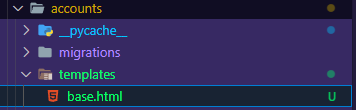
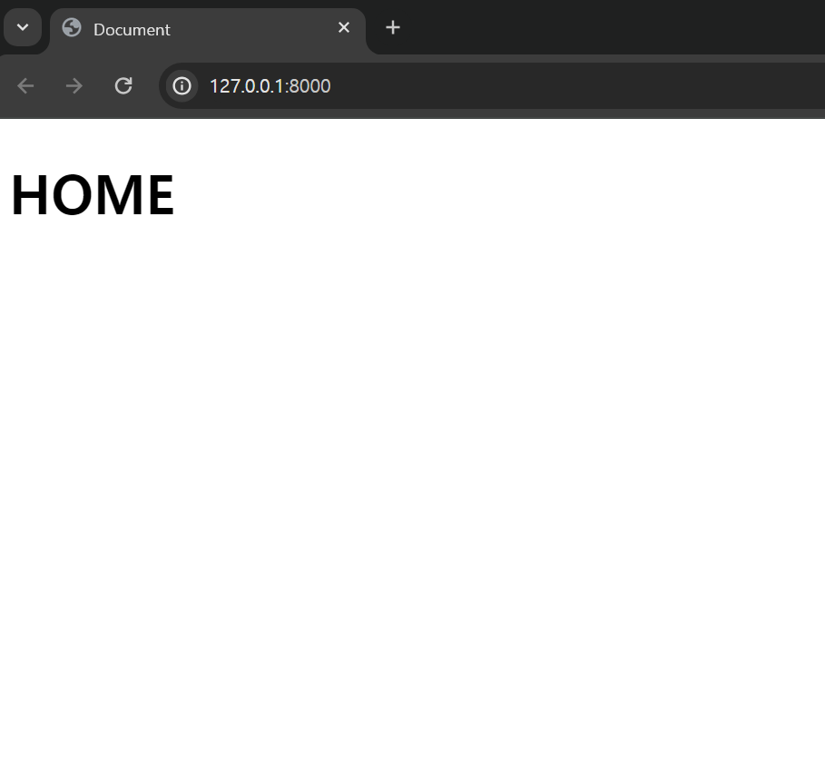
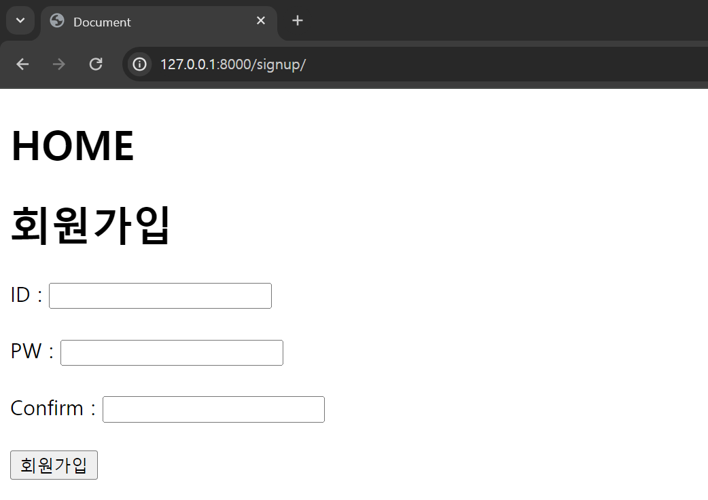
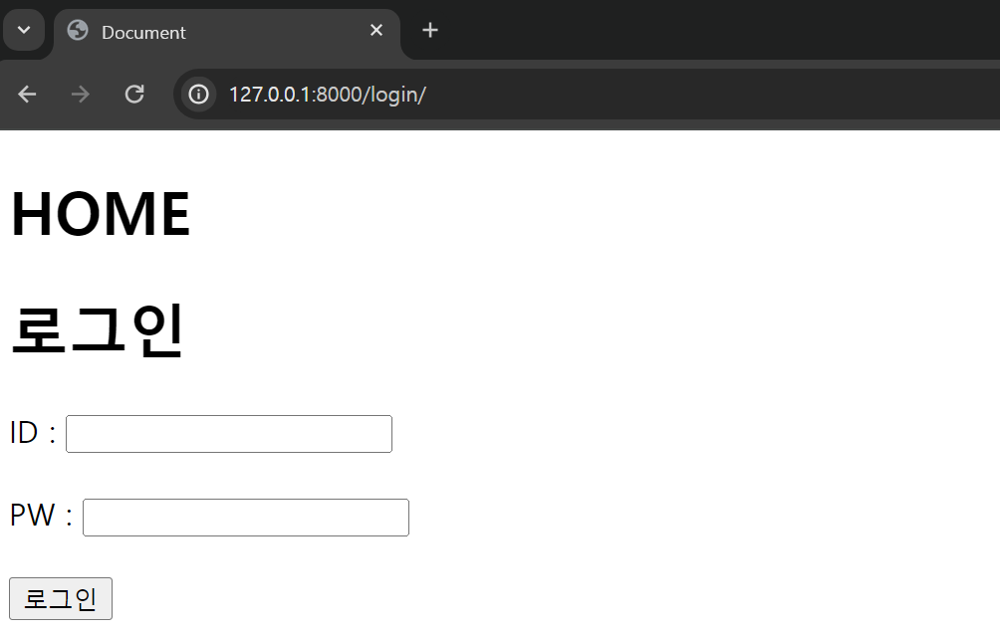

우리는 저번 과정에서 `url` 경로에 대한 로직을 만들었다.

> 비어있기는 했지만

그래서 우리의 서버에 사용자가 접근했을 때

> 아 ~ 경로에 맞는 데이터를 주세요 하고 `GET` 요청을 보내는 것 까지 확인했다.

그럼 우린 이제, 사용자가 `GET` 요청을 보냈을 때 적절한 데이터를 전송시켜주면 된다.

# 뷰 관련 파일 만들기

`Django` 에서는 이런 파일들을 `view` 관련 파일이라 하며

주로 `templates` 폴더 내부에서 `HTML` 문서들을 생성해둔 후 `HTML` 문서들을 건내준다.

## `base.html` 만들기



다음처럼 `templets` 폴더를 만들어주고 해당 폴더 내부에서 `base.html` 을 생성해주자

**우리는 지금 `app` 역할을 하는 `accounts` 폴더 내부에 `templets` 폴더에 `base.html` 을 생성해준 것이다.**

`base.html` 이 의미하는 것은 각 주소 별 건내줄 정말 가장 `base` 한 페이지이다.

```html


<!DOCTYPE html>
<html lang="en">
  <head>
    <title>Document</title>
    <meta charset="UTF-8" />
    <meta name="viewport" content="width=device-width, initial-scale=1.0" />
    <link rel="stylesheet" href="" type="text/css" />
     
  </head>
  <body>
    <h1>HOME</h1>
     
  </body>
</html>
```

`Django` 는 `html` 의 상속이란 개념을 사용하는데 이건 나중에 공부하자

자 우리는 가장 뼈대가 되는 `HTML` 문서를 생성했다.

이 뼈대가 되는 홈페이지 문서가 `/` 경로에 사용자가 접근하면 전송되도록 해보자

`accounts/views.py` 파일을 열어

```python
from django.shortcuts import render

# Create your views here.

def login(): # /login 에 접속시 사용할 로직
  pass

def logout(): # /logout 에 접속시 사용할 로직
  pass

def signup(): # /signup 에 접속시 사용할 로직
  pass

def home(request): # / 에 접속시 사용할 로직
  return render(request,'base.html')
```

다음처럼 변경해준다.

### `views.py` 파일의 역할

`views.py` 는 사용자의 요청 (`URL` 에 대한 접속) 에 대해 적절한 페이지를 제공하고

해당 페이지의 기능을 제공하기 위해 존재한다.

`views.py` 파일 내부에 존재하는 함수는 다음과 같은 인수를 받는다.

`request` 객체 : 사용자가 `URL` 에 접속 할 때 서버 측으로 보낸 요청 정보이다.

> 이건 `HTTP` 의 개념을 좀 알면 좋은데, 사용자가 우리 페이지에 들어오면 서버 측으로
> 자신의 정보 및 기타 정보를 담은 `request` 라는 객체를 보낸다.
> 서버는 `request` 객체를 받아 사용자를 인식하고 사용자에게 `response` 라는 객체에 데이터를 담아 보낸다.
> 우리는 `response` 객체에 `base.html` 문서를 담아 보낸 것이다.

### 실험해보기



와우 야호~!~!!!~!~!~!~!~!!~!~!~!~!~!!~!

`/` 경로에 사용자가 접근하면

서버는 사용자에게 `base.html` 문서를 보내줘서 브라우저 창에 `base.html` 문서가 뜨고 있다.

야호 ~!~!~!

# 우린 앞으로 무엇을 해야할까 ?

`base.html` 로 뼈대 문서를 만들었고 `/` 경로에 대해 요청에 응답하는 문서를 만들었다.

그럼 우린 이제 `/login , /signup` 경로에 대한 요청에 응답 할 문서를 만들면 된다.

## `signup` 문서 만들기

```html
 

<div class="container">
  <h1>회원가입</h1>
  <form method="POST" action="">
    ID :
    <input name="username" type="text" value="" />
    <br />
    <br />
    PW :
    <input name="password1" type="password" value="" />
    <br />
    <br />
    Confirm :
    <input name="password2" type="password" value="" />
    <br />
    <br />
    <input class="btn btn-primary" type="submit" value="회원가입" />
  </form>
</div>

```

자 내가 만든 `signup.html` 문서는 뼈대 문서 내부에 존재하는

` ` 내부에서 렌더링 될 것이다.

좀 어려운 말이지만 이렇게 이해하면 된다.

```html


<!DOCTYPE html>
<html lang="en">
  <head>
    <title>Document</title>
    <meta charset="UTF-8" />
    <meta name="viewport" content="width=device-width, initial-scale=1.0" />
    <link rel="stylesheet" href="" type="text/css" />
     
  </head>
  <body>
    <h1>HOME</h1>
      # 이 안에 signup.html 이 들어간다
  </body>
</html>
```

응답으로 보낼 문서를 만들었으니 `views.py` 에 존재하는 `signup` 함수를 변경해주자

```python
def signup(request): # /signup 에 접속시 사용할 로직
  return render(request,'signup.html')
```

이제 앞으로 `/signup` 경로에 접근하여 사용자가 서버측에 `GET` 요청을 보내면

`signup` 함수가 실행되고 서버는 사용자에게 `signup.html` 문서를 응답으로 보낼 것이다.



이렇게 !!!!!!!!!!!!!!!!!!!

## `login` 문서 만들기

얘도 똑같다.

`login.html` 문서를 만들고

`views.py` 내부의 함수 `login` 에서 `login.html` 을 응답으로 보내주면 된다.

```html
 
<div class="container">
  <h1>로그인</h1>
  <form method="POST" action="">
     ID :
    <input name="username" type="text" value="" />
    <br />
    <br />
    PW :
    <input name="password" type="password" value="" />
    <br />
    <br />
    <input class="btn btn-primary" type="submit" value="로그인" />
  </form>

   {{error}} 
</div>


```

동일하게 `templates` 폴더에서 `login.html` 문서를 만들어주고

```python
# views.py
def login(request): # /login 에 접속시 사용할 로직
  return render(request,'login.html')
```

`login` 함수에서 해당 문서를 보내주도록 하자



야호

기능은 다음 `docs` 에서 추가해주도록 하자
