우리는 지난 과정에서 `/login , /signup` 경로에 접근하면

보내줄 `HTML` 문서를 만들었다.

이제 해당 문서가 기능 하도록 변경해보자

# 로직 추가하기

```python
from django.shortcuts import render , redirect
# 회원가입 및 로그인 기능을 위한 라이브러리 import

from django.contrib.auth.models import User
from django.contrib import auth


# Create your views here.


def signup(request):
    if request.method == "POST":
        if request.POST['password1']==request.POST['password2']:
            user=User.objects.create_user(request.POST['username'], password=request.POST['password1'])
            auth.login(request,user)
            return redirect('home')
    return render(request,'signup.html')

def login(request):
    if request.method == "POST":
        username = request.POST['username']
        password = request.POST['password']
        user = auth.authenticate(request, username=username, password=password)
        if user is not None:
            auth.login(request, user)
            return redirect('home')
        else:
            return render(request,'login.html', {'error':'username or password is incorrect'})
    else:
        return render(request,'login.html')

def logout(request):
    if request.method == "POST":
        auth.logout(request)
        return redirect('home')
    return render(request,'signup.html')

def home(request): # / 에 접속시 사용할 로직
  return render(request,'base.html')
```

이렇게 작성후 회원가입에서 가입 버튼을 누르면 다음과 같은 오류가 발생한다.

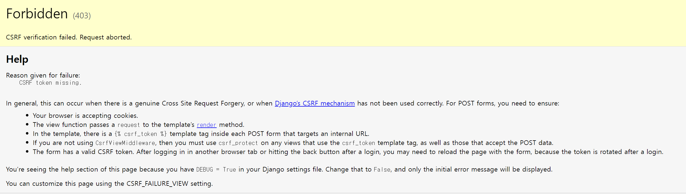

이건 회원가입이나 로그인 시 `ID , PASSWORD` 가 네트워크에서 나쁜 의도를 가진 사람이 탈취해갈 가능성이 있으니 보안에 신경쓰라는 오류이다.

`login , signup` 문서에서 `CSRF` 문제를 해결하기 위해 다음과 같은 코드를 추가해주자

```html
 
<div class="container">
  <h1>로그인</h1>
  <form method="POST" action="">
     ID : # 추가
    <input name="username" type="text" value="" />
    <br />
    <br />
    PW :
    <input name="password" type="password" value="" />
    <br />
    <br />
    <input class="btn btn-primary" type="submit" value="로그인" />
  </form>

   {{error}} 
</div>


```

```html
 

<div class="container">
  <h1>회원가입</h1>
  <form method="POST" action="">
     ID : # 추가
    <input name="username" type="text" value="" />
    <br />
    <br />
    PW :
    <input name="password1" type="password" value="" />
    <br />
    <br />
    Confirm :
    <input name="password2" type="password" value="" />
    <br />
    <br />
    <input class="btn btn-primary" type="submit" value="회원가입" />
  </form>
</div>

```

## 회원가입 시도해보기

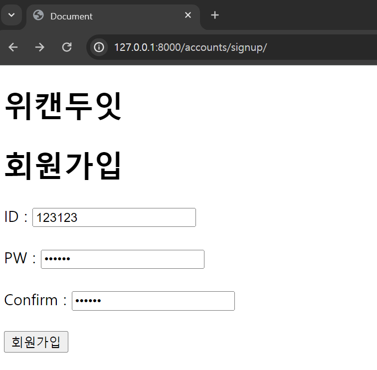

다음과 같이 작성하고 회원가입 버튼을 누르면 다음과 같은 오류가 발생한다.

```
OperationalError at /signup/
no such table: auth_user
Request Method:	POST
Request URL:	http://127.0.0.1:8000/signup/
Django Version:	5.0.4
Exception Type:	OperationalError
Exception Value:
no such table: auth_user # 너가필요로 하는 해당 데이터베이스 테이블을 모샃ㅈ았어
Exception Location:	C:\Users\ttddc\myenv\Lib\site-packages\django\db\backends\sqlite3\base.py, line 329, in execute
Raised during:	accounts.views.signup
Python Executable:	C:\Users\ttddc\myenv\Scripts\python.exe
Python Version:	3.12.0
Python Path:
['C:\\Users\\ttddc\\OneDrive\\바탕 화면\\github\\djangostudy\\mysite',
 'C:\\Users\\ttddc\\AppData\\Local\\Programs\\Python\\Python312\\python312.zip',
 'C:\\Users\\ttddc\\AppData\\Local\\Programs\\Python\\Python312\\DLLs',
 'C:\\Users\\ttddc\\AppData\\Local\\Programs\\Python\\Python312\\Lib',
 'C:\\Users\\ttddc\\AppData\\Local\\Programs\\Python\\Python312',
 'C:\\Users\\ttddc\\myenv',
 'C:\\Users\\ttddc\\myenv\\Lib\\site-packages']
Server time:	Sun, 07 Apr 2024 16:06:12 +0000
```

너가 회원가입 시 사용할 데이터베이스 테이블을 못찾았다고 한다.

그 이유는

```python
# views.py
from django.contrib.auth.models import User
from django.contrib import auth
...
```

`django` 의 `User` 와 `auth` 라이브러리를 이용해 유저 관련 행위를 하도록 정의해뒀는데

유저 정보를 저장할 데이터베이스 테이블을 생성해두지 않았기 때문이다.

그니까 오류를 좀 더 이야기 해보면

너가 `User` 라이브러리를 사용하기 위한 `auth_user` 데이터 테이블을 못찾았다 이야기 하는거다.

### `auth_user` 데이터 테이블 생성하기

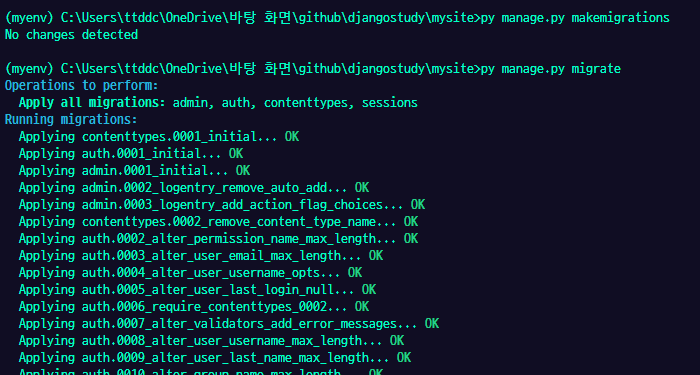

다음처럼 `py manage.py makemigrations` 를 실행 시켜 `auth_user` 데이터 테이블을 생성해주자


뾰로롱

이후 `py manage.py migrate` 를 실행시켜 생성된 `auth_user` 데이터 테이블을 내 프로젝트에서 사용할 데이터 베이스 역할을 하도록 설정해주는 것이다.

이로서 우리의 서버는 데이터베이스로 `auth_user` 를 사용 할 수 있다.

---

# 기능이 작동하는지 확인해보자

### 정상적으로 회원 가입 해보기

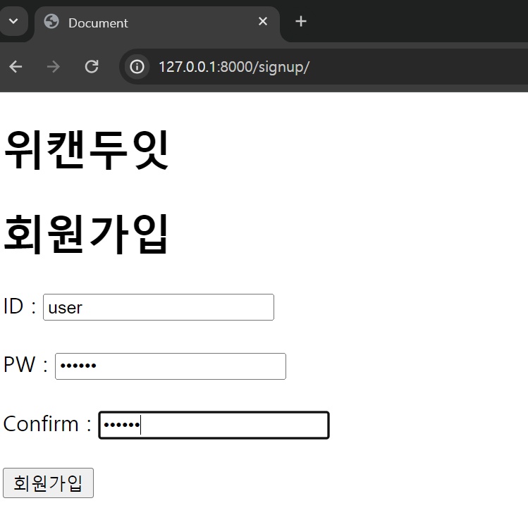

`PW , Confirm` 에서 모두 동일한 비밀번호를 입력하여 정상적으로 회원가입이 가능하게 해봤다.

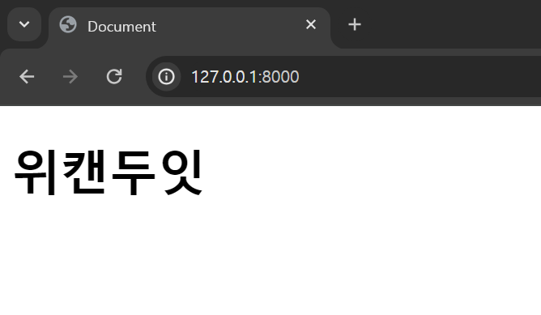

설정한데로 회원가입이 완료되면 `/` 경로로 사용자를 리다이렉트 시킨다.

### 비정상적으로 회원 가입 해보기

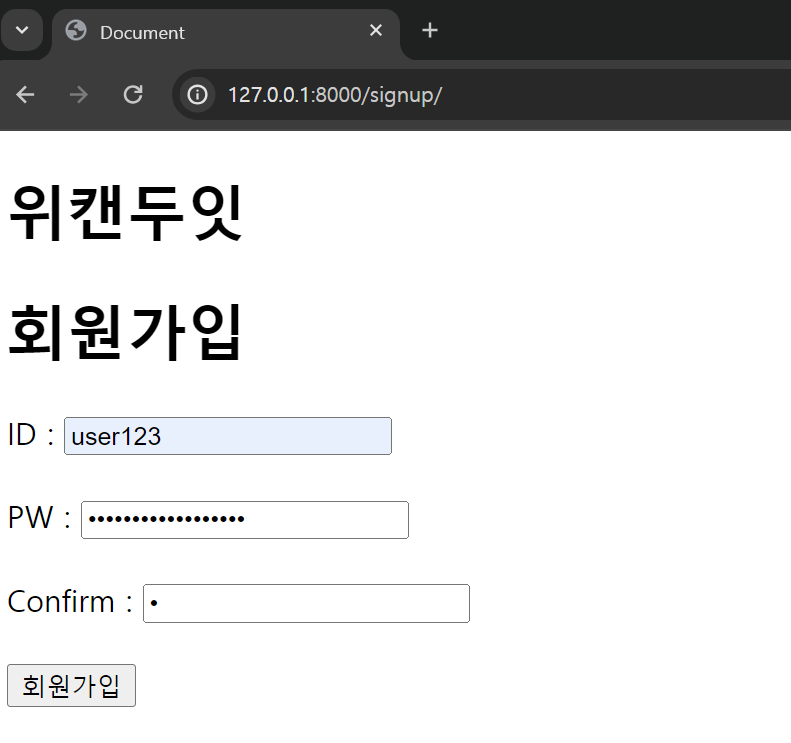

이번엔 `PW , Confirm` 에서 서로 비밀번호가 맞지 않게 하고 회원가입을 해보자

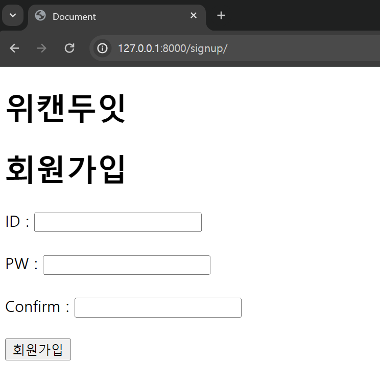

회원가입이 완료되지 않고 다시 회원가입 페이지로 돌아간다.

잘 작동한다.

### 로그인 해보기

오케이 그럼 회원가입은 끝났고

그럼 로그인으 잘되나 ?

### 정상적으로 로그인 해보기

아까 회원가입했던 `ID : user , Password : 123123` 으로 로그인 해보자

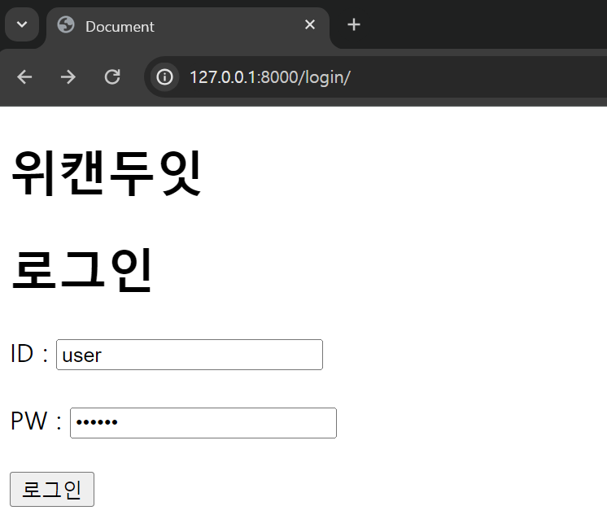

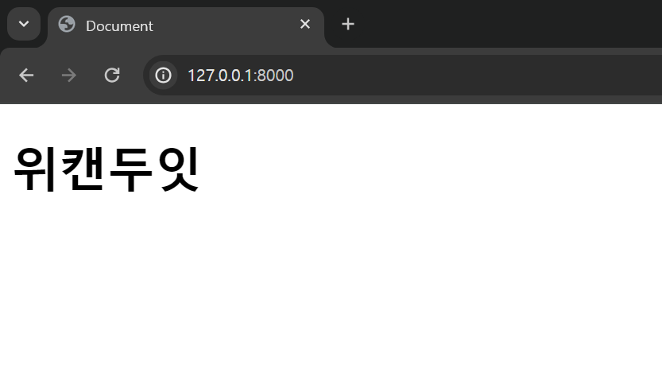

홈페이지로 잘 리다이렉트가 된다.

### 비정상적으로 로그인 해보기

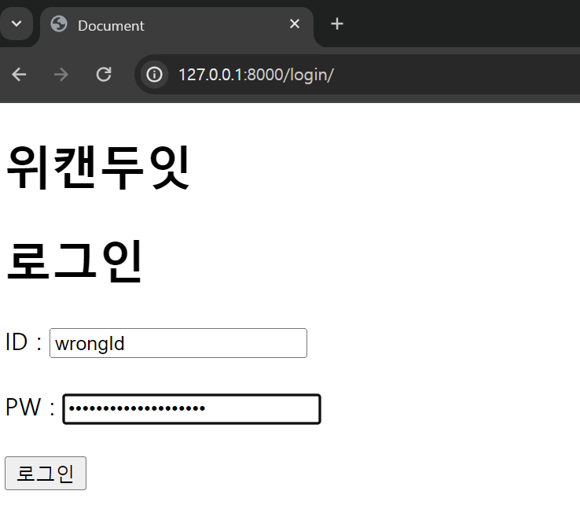

이번엔 서버 데이터베이스에 존재하지 않는 아이디와 비밀번호로 로그인해보자

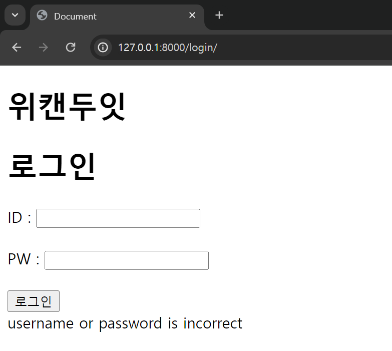

야호 ~~!~!~!!~

---
