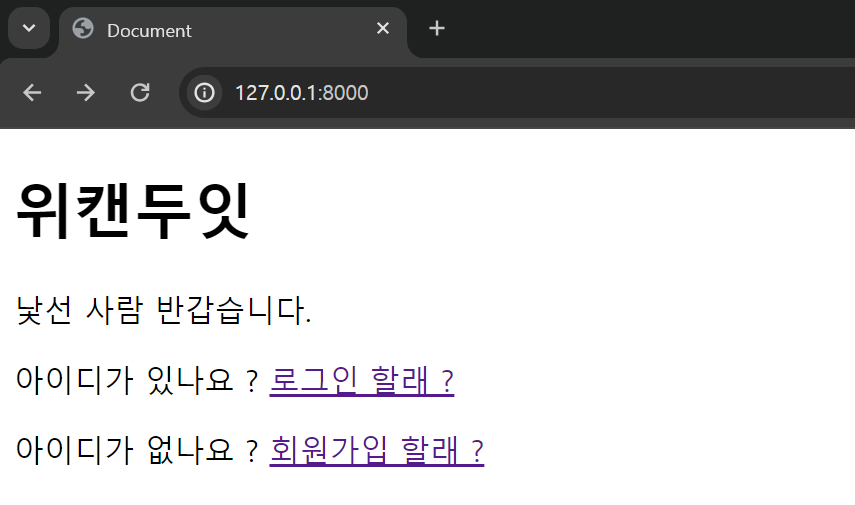
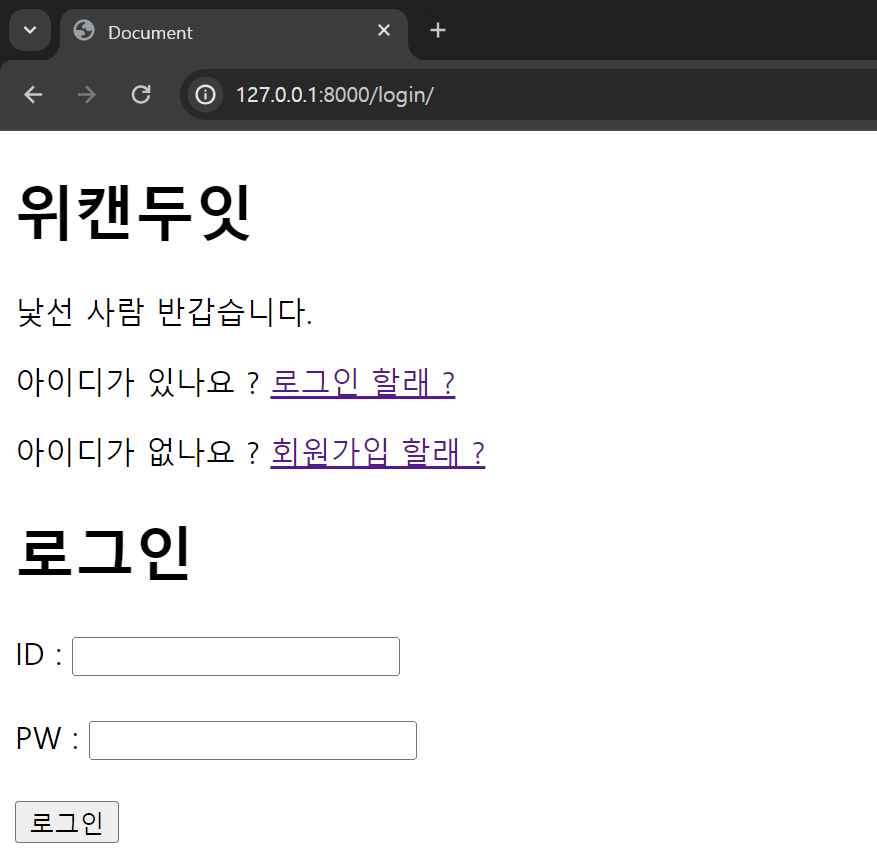

이전 `docs` 에서 회원가입과 로그인을 구현했다.

# `/` 경로에서 로그인 된 사람 구별하기

하지만 사실 로그인 후 홈페이지에서 내가 잘 로그인되어있나 ? 확인 할 방법이 없었다.

그러니 로그인 되어있을 경우 나의 유저 아이디와 반갑다는 인사를 하도록

로직을 변경해주자

`views.py` 에 들어가 `/`페이지에서 사용될 로직인 `home` 함수를 수정해주자

```python
...
# 로그인 상태를 확인하기 위한 라이브러리 import
from django.contrib.auth.decorators import login_required # 추가로 import
...
def home(request): # / 에 접속시 사용할 로직
    if request.user.is_authenticated:
        # 로그인한 사용자의 이름을 템플릿에 전달
        return render(request, 'base.html', {'username': request.user.username})
    else:
        # 로그인하지 않은 사용자의 경우 다른 처리를 할 수 있음
        return render(request, 'base.html')
```

자 , 만약 사용자가 인증되었다면 , `base.html` 을 렌더링 하는데 `username` 이란 객체에

사용자의 `username` 값을 이용해서 렌더리을 해줘

라고 로직을 변경해주었다.

> 좀 더 엄밀히 말하면 사용자가 `/` 페이지에 `GET` 요청을 보낼 때 서버측으로 보낸 `request` 객체에서 `user.username` 의 값을 가져와 `base.html` 에 보내는 것이다.

그럼 `base.html` 에서 `username` 객체를 받아와 렌더링 하도록 수정해주자

```html


<!DOCTYPE html>
<html lang="en">
  <head>
    <title>Document</title>
    <meta charset="UTF-8" />
    <meta name="viewport" content="width=device-width, initial-scale=1.0" />
    <link rel="stylesheet" href="" type="text/css" />
    
  </head>
  <body>
    <h1>위캔두잇</h1>
    
    <!--만약 username 을 받았다면-->
    <p>안녕! {{ username }} 우리 서버는 로그인 된 널 기억해</p>
    <!--username 에게 인사를 합시다-->
    
    <!-- 만약 안받았다면 -->
    <p>낯선 사람 반갑습니다. 원한다면 회원가입 할래 ?</p>
    <!--낯선이에게 반갑다고 인사합시다-->
     
  </body>
</html>
```


이렇게 되면 현재 서버는 로그인 된 사용자가 로그인 된 경우 로그인 된 사용자에게

사용자의 이름과 함께 인사말을 건내도록 수정되었다.

만약 사용자가 로그아웃 된 채로 접속한다면 낯선 사람 반갑다며 인사 할 것이다.

# `logout` 기능 구현하기

로그인이 된 상태에서

로그아웃도 가능하게 해보자

```html


<!DOCTYPE html>
<html lang="en">
  <head>
    <title>Document</title>
    <meta charset="UTF-8" />
    <meta name="viewport" content="width=device-width, initial-scale=1.0" />
    <link rel="stylesheet" href="" type="text/css" />
    
  </head>
  <body>
    <h1>위캔두잇</h1>
    
    <p>안녕! {{ username }} 우리 서버는 로그인 된 널 기억해</p>
    <!-- 새로운 문구 추가 -->
    <p>하지만 너가 로그아웃을 원한다면 ..</p>
    <!-- 로그아웃을 가능하게 하는 form 태그 생성 -->
    <form action="logout/" method="post">
      
      <!-- 보안을 위해 csrf 토큰 생성 -->
      <input type="submit" value="logout" />
    </form>
    
    <p>낯선 사람 반갑습니다. 원한다면 회원가입 할래 ?</p>
     
  </body>
</html>
```

로그인이 된 상태에서는 로그아웃을 가능하게 하는 `form` 태그를 생성해주었다.

```python
def logout(request):
    if request.method == "POST":
        auth.logout(request)
        return redirect('home')
    return render(request,'signup.html')
```

해당 제출 버튼을 누르면 사용자는 페이지에서 로그아웃이 되고 홈페이지로 리다이렉트 된다. :)

# 회원 가입으로 이동 시키는 페이지 구현하기


이번엔 회원가입이 안되어있는 경우, 회원 가입 페이지로 이동 시키는 버튼을 만들어보자

```html


<!DOCTYPE html>
<html lang="en">
  <head>
    <title>Document</title>
    <meta charset="UTF-8" />
    <meta name="viewport" content="width=device-width, initial-scale=1.0" />
    <link rel="stylesheet" href="" type="text/css" />
    
  </head>
  <body>
    <h1>위캔두잇</h1>
    <!-- 사용자 이름 표시 -->
    
    <!--만약 username 을 받았다면-->
    <p>안녕! {{ username }} 우리 서버는 로그인 된 널 기억해</p>
    <p>하지만 너가 로그아웃을 원한다면 ..</p>
    <form action="logout/" method="post">
      
      <input type="submit" value="logout" />
    </form>
    <!--username 에게 인사를 합시다-->
    
    <!-- 만약 안받았다면 -->
    <p>낯선 사람 반갑습니다.</p>
    <p>아이디가 있나요 ? <a href="/login/">로그인 할래 ?</a></p>
    <p>아이디가 없나요 ? <a href="/signup/">회원가입 할래 ?</a></p>
    <!--낯선이에게 반갑다고 인사합시다-->
     
  </body>
</html>
```



다음처럼 로그인이 안되어있다면 로그인 혹은 회원가입 페이지로 이동 시키는 `a` 태그를 생성해주었다.



로그인 버튼을 누르면 로그인으로


회원 가입 버튼을 누르면 회원가입 페이지로 이동한다.


