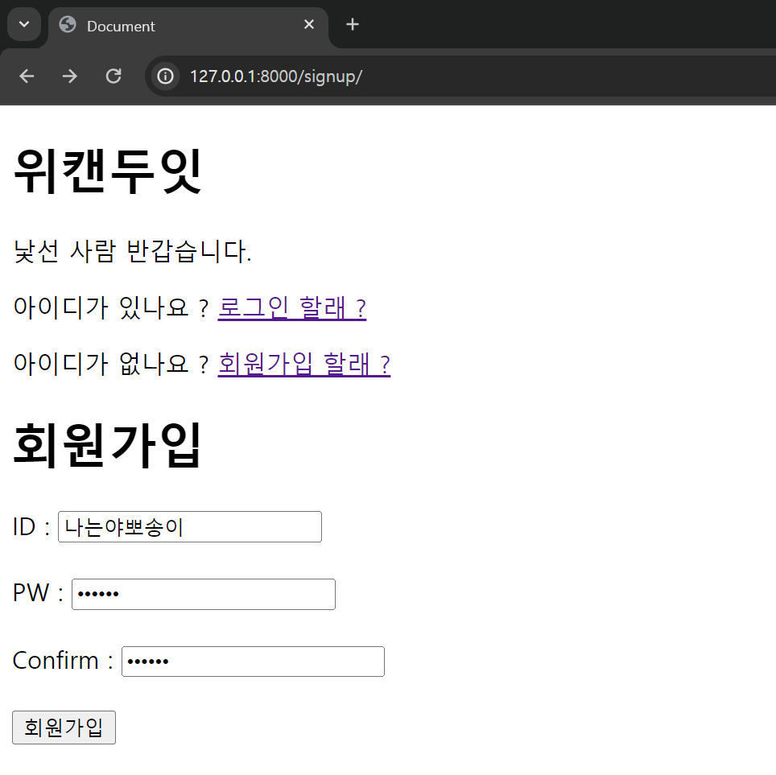
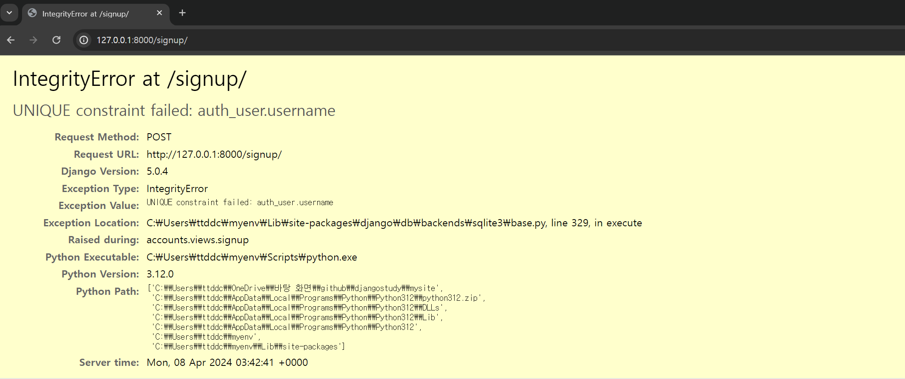

저번 `docs` 에서 기본적인 기능 구현을 가능하도록 수정하였다.

이젠 몇 가지 기능들을 하나씩 세부적으로 추가해나가도록 하자

# 회원가입 시 발생하는 오류

이미 회원가입이 되어있는 계정의 아이디와 같은 계정으로 가입을 하려고 하면

다음과 같은 오류가 뜬다.

`auth_user.username` 은 독립적으로 한 가지만 존재해야 한다고 한다.

당연히 회원가입 하는 `ID` 는 독립적으로 한 가지만 존재해야 하는 것이 맞다.

다만 이런 오류가 발생 할 때 마다 이런식으로 생긴 페이지를 보여주는 것 보다

아이디가 중복된다고 현재 페이지에서 이야기 하는 편이 훨씬 맞을것이다.
