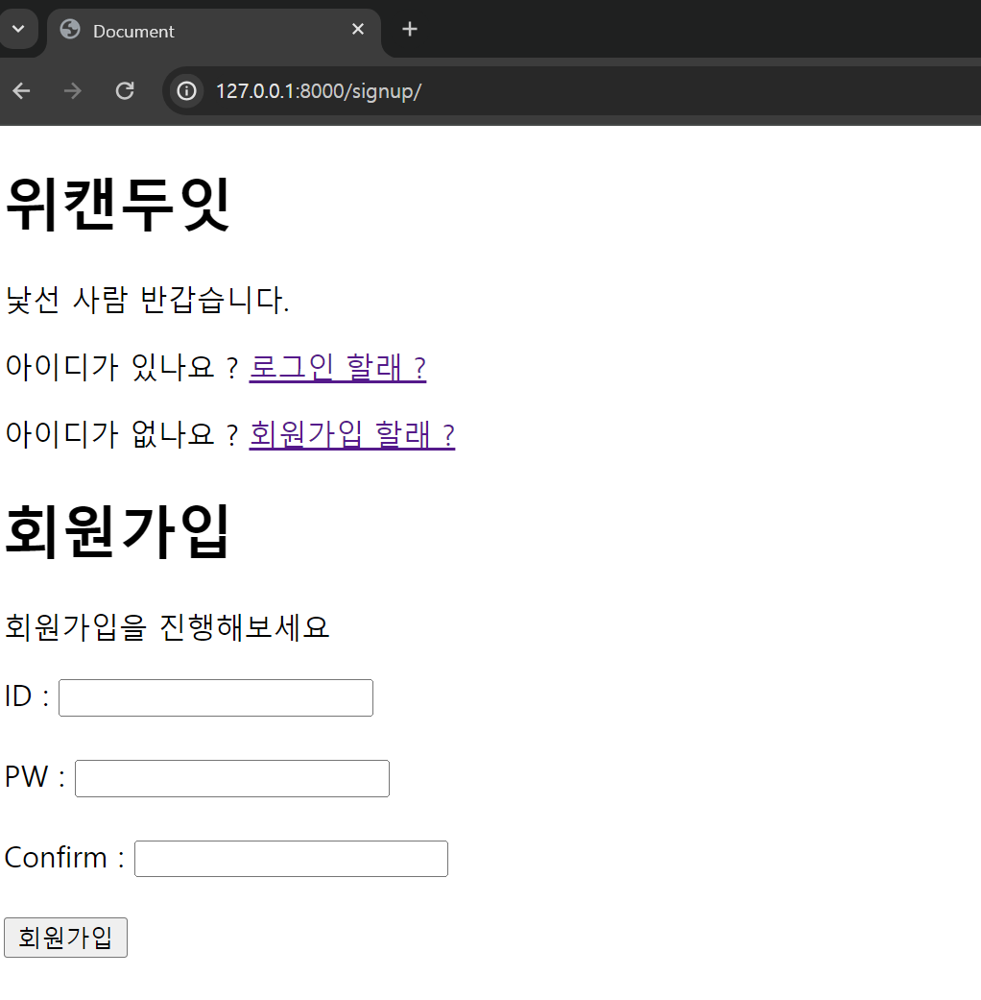
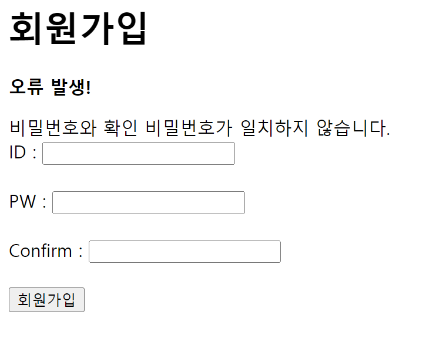
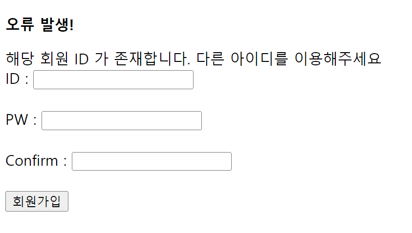

저번 `docs` 에서 기본적인 기능 구현을 가능하도록 수정하였다.

이젠 몇 가지 기능들을 하나씩 세부적으로 추가해나가도록 하자

# 회원가입 시 발생하는 오류


이미 회원가입이 되어있는 계정의 아이디와 같은 계정으로 가입을 하려고 하면


다음과 같은 오류가 뜬다.

`auth_user.username` 은 독립적으로 한 가지만 존재해야 한다고 한다.

당연히 회원가입 하는 `ID` 는 독립적으로 한 가지만 존재해야 하는 것이 맞다.

다만 이런 오류가 발생 할 때 마다 이런식으로 생긴 페이지를 보여주는 것 보다

아이디가 중복된다고 현재 페이지에서 이야기 하는 편이 훨씬 맞을것이다.

### 중복되는 가입자 , 비밀번호가 일치하지 않는 가입자 에러 메시지 분기처리 하기

```python
def signup(request):
    if request.method == 'POST': # POST 요청에 대한 처리
        # 해당 username 이 데이터베이스에 존재하는지 확인
        if User.objects.filter(username = request.POST['username']).exists():
            return render(request,'signup.html',{'error' : '해당 회원 ID 가 존재합니다. 다른 아이디를 이용해주세요' })
        # 비밀번호와 확인 비밀번호가 일치 하지 않는다면 오류 메시지 렌더링 하기
        if request.POST['password1'] != request.POST['password2']:
            return render(request,'signup.html',{'error' : '비밀번호와 확인 비밀번호가 일치하지 않습니다.' })
        # 모든 에러를 해결했다면 회원가입 완료하기
        new_user = User.objects.create_user( # 데이터베이스에 새로운 User 를 만들고
            username=request.POST['username'],
            password=request.POST['password1']
        )
        auth.login(request, new_user) # 만들어진 새로운 유저를 로그인 시킴
        return redirect('home')
    else: # GET 요청에 대한 처리
      return render(request,'signup.html')
```

다음처럼 `signup` 메소드 내부 로직에서 데이터베이스를 조회하는 로직을 추가해주자

이후 데이터베이스에 해당 계정이 존재한다면 다시 `signup.html` 을 에러 메시지와 함께 렌더링 해주도록 하자

`signup` 메소드가 변경됨에 따라 `signup.html` 또한 에러 메시지를 렌더링 할 수 있도록 수정되었다.

### `signup.html` 수정하기

```html
 

<div class="container">
  <h1>회원가입</h1>
  
  <p><strong>오류 발생!</strong></p>
  {{ error }} 
  <p>회원가입을 진행해보세요</p>
  
  <!-- error 메시지가 있다면 띄울 공간-->
  <form method="POST" action="">
     ID :
    <input name="username" type="text" value="" />
    <br />
    <br />
    PW :
    <input name="password1" type="password" value="" />
    <br />
    <br />
    Confirm :
    <input name="password2" type="password" value="" />
    <br />
    <br />
    <input class="btn btn-primary" type="submit" value="회원가입" />
  </form>
</div>

```

`h1` 태그 밑에 에러 메시지가 존재할 경우와 존재하지 않을 경우 문구를 띄울 수 있도록 변경해주었다.

이렇게 되면



에러메시지가 존재하지 않을 경우엔 회원가입을 진행해보란 문구가 뜨고





발생하는 오류에 따라 다른 오류 메시지가 발생한다.
